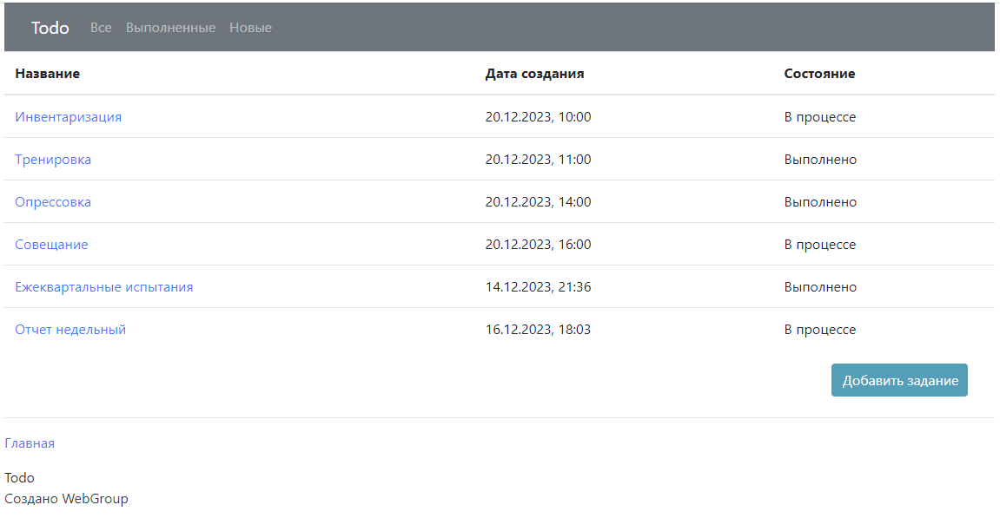
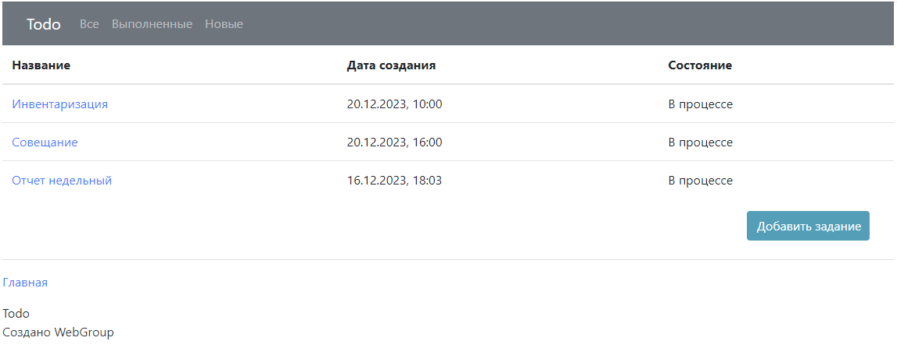
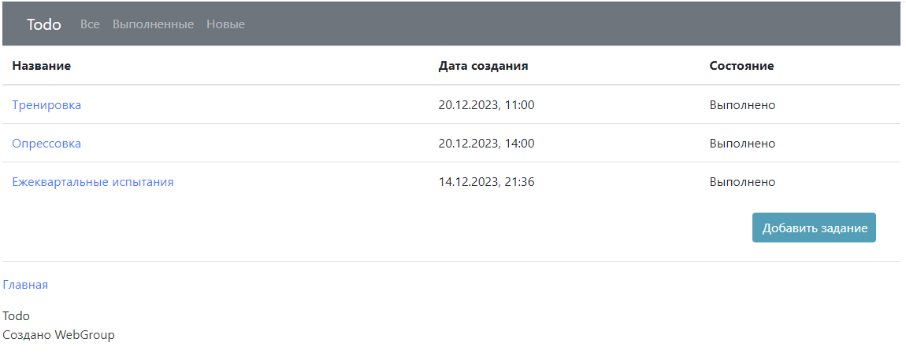
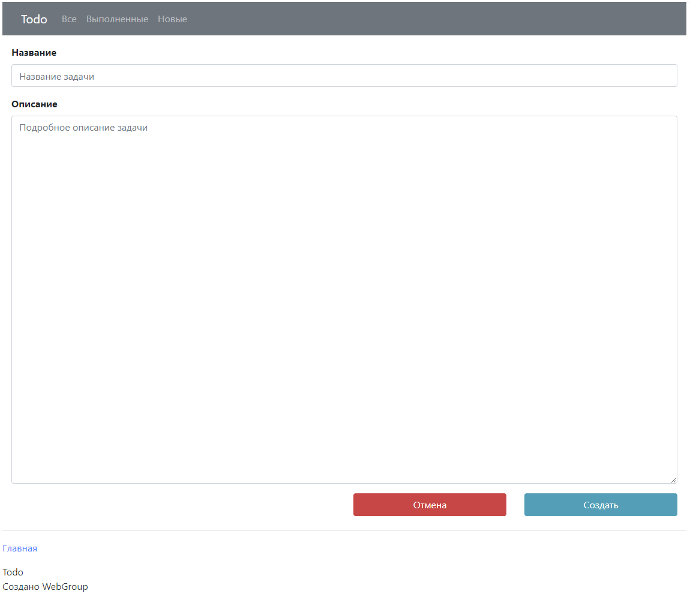
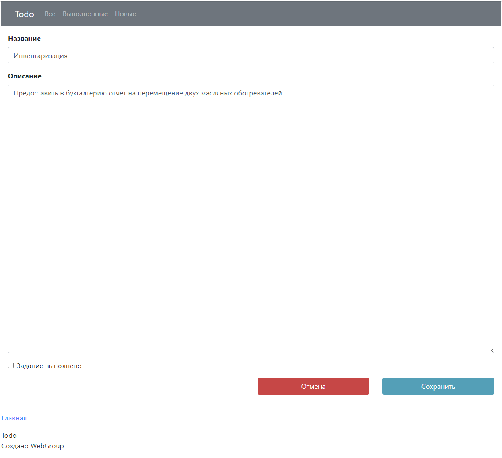
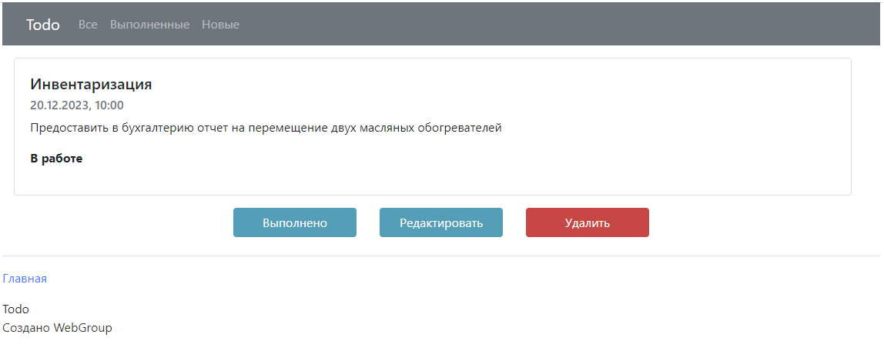

# TODO список
## Описание проекта
Сайт для организации работы или другой деятельности.
На главной странице выводится список задач со статусом - выполнено/в работе.
Присутствует возможность показать список выполенных задач и новых.
Реализована возможность добавлять, удалять, редактировать задачи, изменять статус.

## Стек технологий
- Java 17
- Spring 2.7.3
- Hibernate 5.6.11
- Thymeleaf 3.0.15
- Liquibase 4.15.0
- PostgreSQL 42.2.9
- Maven 4.0.0
- Bootstrap 4.1.3
- Lombok 1.18.22

## Окружение
- Java 17
- PostgreSQL 16
- Apache Maven 4.0.0

## Запуск проекта
1. Скачать архив проекта или создать копию (fork) проекта в своем репозитории и клонировать.
2. Создать локальную базу данных todo, используя интерфейс PostgreSQL 16 или команду:

   ```create database todo```

3. В файл конфигурации db/liquibase.properties внести логин и пароль пользователя для доступа к базе данных todo.
4. Запустить Liquibase для создания таблицы.
5. Для запуска на локальной машине скомпилировать и запустить проект в командной строке

   ```mvn spring-boot:run```

   или после сборки проекта с использованием maven выполнить в командной строке

   ``` java -jar target/job4j_todo-1.0-SNAPSHOT.jar```
6. Перейти по адресу http://localhost:8080/.
## Взаимодействие с приложением

### Список всех задач


### Список новых задач


### Список выполненных задач


### Создание новой задачи


### Редактирование задачи


### Подробное описание задачи


## Контакты

email: gretskih@mail.ru <br/>
telegram: @Anatolij_gr